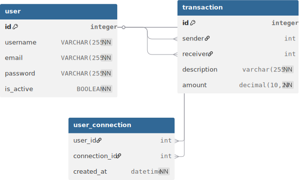

# Pay my Buddy

Application web de transfert d'argent entre amis.
## Description
Pay my Buddy est une application web qui permet aux utilisateurs de transférer de l'argent entre amis de manière simple et sécurisée. Les utilisateurs peuvent créer un compte, ajouter des amis, et effectuer des transferts d'argent instantanés.

## Fonctionnalités
- Création de compte utilisateur
- Ajout et gestion des amis
- Transferts d'argent entre amis
- Historique des transactions
- Sécurité des données et des transactions

## Diagramme de la base de données


## Script SQL de création de la base de données
Le script SQL pour créer la base de données est disponible dans le fichier `docs/Schema.sql`

## Script SQL de peuplement de la base de données
Le script SQL pour peupler la base de données est disponible dans le fichier `docs/Peuplement.sql`

## Script SQL de test de la base de données
Le script SQL pour tester la base de données est disponible dans le fichier `docs/Script.sql`

## Script Bash de sauvegarde de la base de données
Le script Bash pour sauvegarder la base de données est disponible dans le fichier `docs/backup_db.sh`

## Script Bash de restauration de la base de données
Le script Bash pour restaurer la base de données est disponible dans le fichier `docs/restore_db.sh`

## Stored Procedures
### deactivate_user
Passe un utilisateur en état "inactif" dans la base de données.
utilisation : CALL deactivate_user(user_id INT);
### anonymize_user
Anonymise les informations personnelles d'un utilisateur dans la base de données.
utilisation : CALL anonymize_user(user_id INT);


## Note
Pour exécuter les scripts nécessitant un mot de passe, assurez-vous de définir la variable d'environnement "MYSQL_PASSWORD" avec le mot de passe approprié avant d'exécuter les scripts.
Par exemple, dans un terminal bash, vous pouvez utiliser la commande suivante :
```bashexport MYSQL_PASSWORD="votre_mot_de_passe"```
Remplacez "votre_mot_de_passe" par le mot de passe réel que vous souhaitez utiliser.

## Note concernant la suppression des données utilisateurs
Pour des raisons de conformité et de comptabilité, lors de la suppression d'un utilisateur, ses données ne sont pas complètement effacées de la base de données. Au lieu de cela, les informations personnelles sont anonymisées afin de préserver l'intégrité des transactions et des enregistrements financiers. Cela garantit que les historiques de transactions restent intacts tout en respectant la vie privée des utilisateurs.
