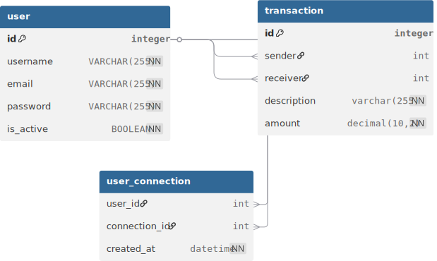

# Pay my Buddy

Application web de transfert d'argent entre amis.

## Description

Pay my Buddy est une application web qui permet aux utilisateurs de transférer de l'argent entre amis de manière simple
et sécurisée. Les utilisateurs peuvent créer un compte, ajouter des amis, et effectuer des transferts d'argent
instantanés.

## Fonctionnalités

- Création de compte utilisateur
- Ajout et gestion des amis
- Transferts d'argent entre amis
- Historique des transactions
- Sécurité des données et des transactions

## Technologies utilisées
- Java 21
- Spring Boot 4
- Spring Data JPA
- Spring Security pour l'authentification et l'autorisation
- Flyway pour la gestion des migrations de la base de données
- H2 Database pour le développement et les tests
- Maven pour la gestion des dépendances et la construction du projet
- JUnit et Mockito pour les tests unitaires
- Swagger pour la documentation de l'API
- Lombok pour réduire le code boilerplate
- MySQL pour la production
- Jacoco pour la couverture de code
- Surefire pour l'exécution des tests
- Log4j pour la gestion des logs

## Diagramme de la base de données

## Script SQL de création de la base de données

Le script SQL pour créer la base de données est disponible dans le fichier `main/resources/db/migration/V1__init_schema.sql`

## Script SQL d'indexation de la base de données
Le script SQL pour indexer la base de données est disponible dans le fichier `main/resources/db/migration/V2__index_tables.sql`

## Script SQL de peuplement de la base de données

Le script SQL pour peupler la base de données est disponible dans le fichier `main/resources/db/migration/V3__insert_users.sql`

## Installation et utilisation
1. Clonez le dépôt GitHub : `git clone
2. Accédez au répertoire du projet : `cd pay-my-buddy`
3. Utilisez Maven pour construire le projet : `mvn clean install`
4. Exécutez l'application : `mvn spring-boot:run`
5. Accédez à l'application via votre navigateur à l'adresse : `http://localhost:8080`

## Note
Si les migrations ne s'effectuent pas correctement, utilisez la commande suivante pour forcer l'exécution des migrations : `mvn flyway:migrate -Dflyway.cleanDisabled=false`

## Note concernant la suppression des données utilisateurs

Pour des raisons de conformité et de comptabilité, lors de la suppression d'un utilisateur, ses données ne sont pas
complètement effacées de la base de données. Au lieu de cela, les informations personnelles sont anonymisées afin de
préserver l'intégrité des transactions et des enregistrements financiers. Cela garantit que les historiques de
transactions restent intacts tout en respectant la vie privée des utilisateurs.
